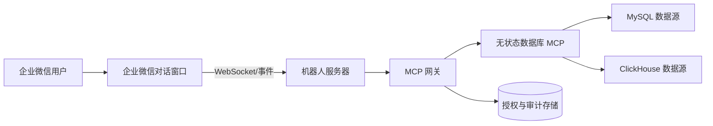

# PRD：企业微信 AI 数据库助手网关

## 1. 文档信息

- 状态：待评审
- 目标项目：独立的企业微信机器人、MCP 网关、身份授权与审计服务
- 关联组件：`mcp-server-for-mysql`，作为无状态数据库 MCP 执行器

## 2. 背景与问题

团队成员需要在企业微信对话中快速查询受限业务数据，并在必要时协助完成数据库结构和数据变更。直接让机器人调用数据库会带来三类风险：调用者身份不可确认、危险 SQL 容易误执行、操作过程缺少可审计记录。

当前数据库 MCP Server 的职责应保持简单，因此企业微信接入、真实用户身份、角色权限、二次确认、令牌单次消费和审计持久化必须由独立网关负责。

## 3. 产品愿景

让程序员、策划和 QA 在企业微信中以自然语言发起数据库查询。机器人借助上下文选择正确数据源并调用 MCP；常规查询快速返回，危险操作必须向真实用户展示完整 SQL 并得到明确确认。每一次请求、确认和执行都可以按用户、会话、数据源和请求 ID 追溯。

## 4. 目标与非目标

### 目标

- 从企业微信机器人会话可靠取得真实用户 ID 和用户属性。
- 根据用户角色和目标数据源决定是否允许请求。
- 驱动 MCP 查询和高层数据库工具，向用户返回简洁结果。
- 对需要确认的操作展示完整 SQL、风险和目标数据源；只在真人确认后执行。
- 持久化审计事件与确认状态，阻止令牌重放。
- 在不改变当前 MCP 简洁边界的前提下提供安全控制。

### 非目标

- 在首版构建复杂的组织架构同步、审批流引擎或自助权限后台。
- 替代数据库原生权限、备份、恢复、变更发布或运维平台。
- 导出大规模数据或提供 BI 报表。
- 在网关中做列级脱敏；首版按“所查即所得”返回，数据边界依赖数据库账号与角色授权。

## 5. 用户与角色

| 角色 | 来源 | 能力 |
| --- | --- | --- |
| 管理员 | `admin_users` 用户 ID 列表 | 可查询、变更结构和执行原生 SQL；仍须走确认策略 |
| 普通用户 | `normal_users` 用户 ID 列表 | 可查询和受控数据写入；无结构管理权限 |
| 游客 | `guest_users` 用户 ID 列表，或未命中用户 | 只读查询 |

角色优先级是管理员、普通用户、游客。任一用户未命中所有列表时，一律作为游客处理。首版通过配置中的用户 ID 列表管理角色；未来可替换为企业微信部门或外部 IAM 映射。

## 6. 系统边界与架构



### 企业微信机器人服务器

接收企业微信事件，验证平台回调，将真实企业微信用户 ID、会话 ID 和消息上下文传给网关，并负责向用户发送预览、确认提示和结果。机器人服务是 MCP 网关的可信调用方。

### MCP 网关

负责上下文编排、角色判定、目标数据源许可、调用意图判断、二次确认、令牌签发/单次消费、审计和 MCP 客户端调用。网关不得把未获批准的危险请求转为 MCP 的 `confirm: true` 调用。

### 无状态数据库 MCP

只负责数据库发现、SQL 规划、风险分类、预览哈希和执行。它不保存用户、角色、确认状态或审计记录；MCP 的详细契约见关联设计规范。

## 7. 核心用户流程

### 7.1 查询

1. 用户在企业微信提出查询需求。
2. 机器人获取用户 ID 并把上下文交给网关。
3. 网关验证用户角色和数据源权限，选择或要求澄清数据源。
4. 网关调用 MCP 的 `describe_table`、`query` 等工具。
5. 机器人将有限、结构化结果回发给用户，并写入审计日志。

### 7.2 危险操作预览与确认

1. 用户请求结构或数据变更。
2. 网关依据角色和目标数据源判断是否允许；不允许则直接拒绝并审计。
3. 网关调用 MCP 预览，取得完整 SQL、风险摘要和 `preview_hash`，不执行。
4. 机器人在企业微信向同一用户展示数据源、完整 SQL、风险和明确确认控件/指令。
5. 用户确认后，网关再次验证该用户、会话、操作内容、有效期和未消费状态。
6. 网关以 `confirm: true` 和原始 `preview_hash` 调用 MCP。
7. 网关记录执行结果，并向用户回传成功或失败信息。

### 7.3 严格模式

当数据源或组织策略选择严格模式时，查询也执行预览和确认流程。快捷模式仅要求高风险操作确认。模式是网关策略和 MCP 配置的共同约束，网关不得放宽 MCP 的要求。

## 8. 授权与确认设计

网关为每次需要确认的操作创建持久化的授权记录，至少包含：

- 授权 ID、请求 ID、企业微信用户 ID、会话 ID、角色。
- 数据源 ID、MCP 工具名、完整 SQL、参数摘要、`preview_hash`。
- 风险级别、创建/过期/确认/消费时间和最终结果。

网关只对已经由真人确认且未过期、未消费、内容未变化的记录放行。确认记录必须原子地从“已确认”转为“已消费”，防止并发重复执行。

网关可向其内部组件签发 JWT，默认使用 HMAC-SHA256。JWT 至少包含签发方、受众、签发/过期时间、授权 ID、用户 ID、会话 ID、数据源、`preview_hash` 与唯一 ID。签名用于组件间防篡改；是否已消费仍必须由持久化存储判断，不能仅依赖 JWT。

当前 MCP 不验证用户 JWT。网关完成上述检查后才使用 MCP 的 `confirm: true` 协议，保证当前 MCP 保持无状态和中立。

## 9. 数据源与权限策略

网关维护可见数据源目录，并按角色配置访问规则。默认策略：

- 管理员可访问已授权的 MySQL/ClickHouse 数据源和所有 MCP 工具。
- 普通用户可访问已授权数据源的只读和受控写入工具；结构与原生高风险执行拒绝。
- 游客只能调用只读工具。

数据源权限与用户角色都采用默认拒绝。数据源目录只暴露业务名称、说明、类型和允许范围，不暴露 DSN、主机、端口、库名或密码。

数据库账号仍应按数据源配置最小权限。网关的逻辑授权不能代替数据库自身权限。

## 10. 审计与数据保留

网关持久化以下事件：请求接收、角色判定、数据源选择、MCP 预览、确认、拒绝、令牌消费、执行成功和执行失败。日志关联 `request_id`、企业微信会话和用户 ID。

默认审计记录 SQL 摘要、风险和结果摘要。完整 SQL 的保存由组织配置显式开启，并定义保留期限和访问范围。审计库不得保存 DSN、密码、令牌密钥或完整查询结果集。

保留期、清理策略、备份和审计访问控制应由部署方确定；首版必须支持可配置的过期清理。

## 11. 非功能需求

- 可用性：网关、MCP 和数据库任一不可用时返回明确失败，不得回退到绕过确认或绕过授权的路径。
- 安全性：企业微信回调验证、服务间 mTLS 或内网访问控制、密钥通过 Secret 注入、最小数据库权限、默认拒绝。
- 一致性：确认消费必须具备原子性；一个确认最多触发一次执行。
- 可观测性：结构化日志、指标、请求链路 ID、授权状态和数据库调用耗时。
- 隐私：用户身份与审计数据仅用于安全追溯；严格限制可访问人群。
- 性能：常规查询不应等待确认；网关不缓存或传输超大结果集。

## 12. 配置草案

```yaml
roles:
  admin_users: [wecom-user-a]
  normal_users: [wecom-user-b]
  guest_users: []

sources:
  orders:
    mode: quick
    roles: [admin, normal, guest]
  production-admin:
    mode: strict
    roles: [admin]

confirmation:
  expires_in: 5m
  jwt_algorithm: HS256
  jwt_secret_env: GATEWAY_CONFIRMATION_SECRET

audit:
  store_full_sql: false
  retention_days: 90
```

敏感密钥必须通过环境变量或 Secret 注入，不能写入配置仓库。

## 13. 验收标准

- 企业微信事件可取得并验证真实用户 ID，未识别用户按游客处理。
- 游客无法发起写入或结构操作；普通用户无法执行管理员操作。
- 高风险请求在用户确认前不调用 MCP 的执行路径。
- 确认界面始终展示目标数据源、完整 SQL、风险和有效期。
- 同一确认记录不能被第二次消费；SQL、参数、数据源或用户变化后确认失效。
- 快捷/严格模式与当前 MCP 行为一致，任何一方要求确认时均不可绕过。
- 每个请求可按 `request_id` 追踪身份、授权、确认和执行结果。
- MCP 或数据库故障不会导致未授权执行，且能向用户返回可理解的错误。

## 14. 分阶段交付

1. 企业微信事件接入、用户 ID 获取和基础会话编排。
2. 角色列表、数据源目录、MCP 客户端和只读查询流程。
3. 危险操作预览、确认记录、原子消费和执行回传。
4. 审计、指标、告警、密钥管理和部署加固。
5. 组织目录/IAM、审批流和更细粒度策略等后续扩展。

## 15. 依赖与风险

- 企业微信机器人服务器必须可靠验证回调并只传递经过验证的用户 ID。
- 当前 MCP 的 `confirm: true` 是无状态协议，不能单独承担真人确认或防重放；网关必须控制其调用入口。
- 数据库最小权限、网络隔离和备份策略仍是生产安全前提。
- 完整 SQL 审计与“所查即所得”需求可能包含敏感业务数据，部署前需由组织确认访问与保留政策。

